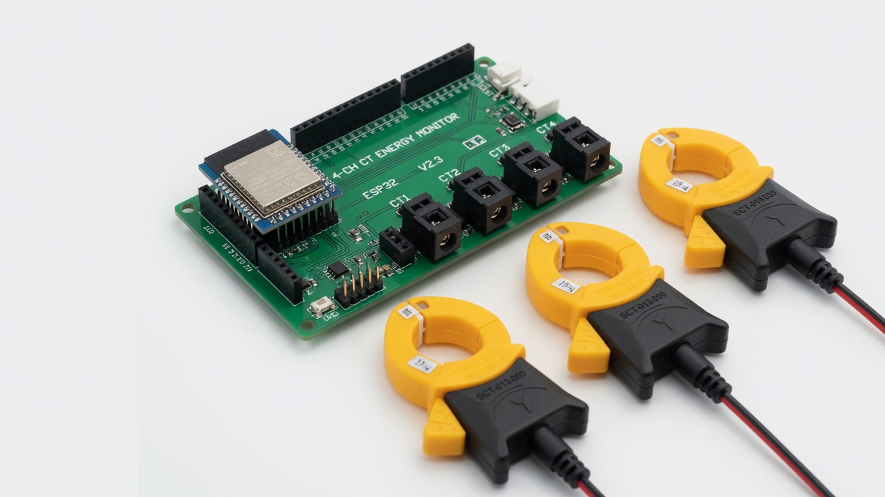
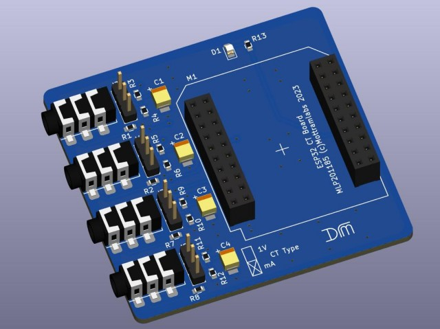
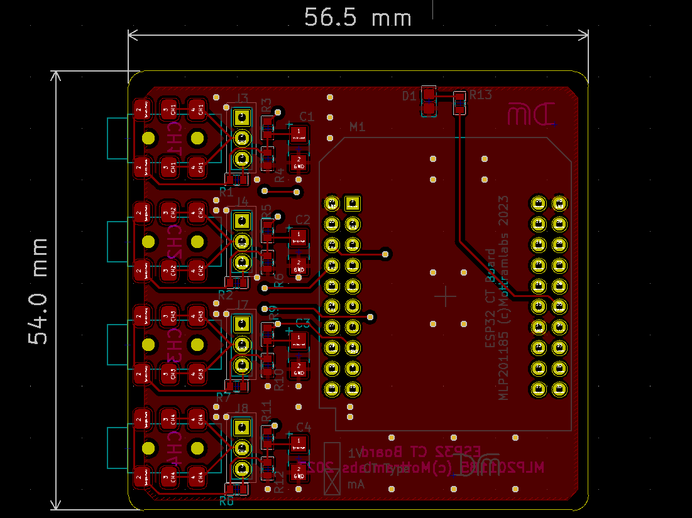

# ESP32 MottramLabs — 4 pinces ampèremétriques

Firmware [ESPHome](https://esphome.io/) pour la carte **MottramLabs 4-channel CT** (ESP32) : quatre courants RMS via pinces **SCT-013**, exposés à Home Assistant.

<p align="center">
  
</p>

<p align="center">
  
</p>

*Rendu constructeur MLP201185 (Wemos ESP32) — [MottramLabs](https://www.mottramlabs.com/ct_products.html).*

---

## À quoi ça sert

Mesurer le **courant** de 4 circuits (tableau, PAC, cumulus, prises, PV…) sans ouvrir les fils : la pince se clipse autour d’**un seul** conducteur actif.

Cette config sort des **ampères RMS** (pas des watts) : pour la puissance, multiplie par ta tension (ex. 230 V) dans HA, en sachant que sans tension mesurée ce n’est qu’une estimation (cos φ ≈ 1).

Les 4 voies ont des **courbes de calibration** différentes (charges réelles). Recalibre si tes pinces / ta carte changent.

---

## Matériel

| Élément | Rôle | Lien |
| --- | --- | --- |
| **MLP201185** (Wemos ESP32) | 4 jacks 3,5 mm + burden | [MottramLabs CT products](https://www.mottramlabs.com/ct_products.html) · [GitHub + schémas](https://github.com/Mottramlabs/ESP32-4-Channel-Mains-Current-Sensor) |
| Variantes | MLP201188 NodeMCU 30 pins, MLP201191 ESP32-S2, MLP201193 38 pins | même page |
| **ESP32** (Wemos / NodeMCU) | à enficher sur la carte | — |
| **SCT-013-000** (100 A / 50 mA) ou SCT-013-030 | pinces | [YHDC SCT-013](https://www.yhdc.com/) |
| Alim USB | carte | — |

<p align="center">
  
</p>

Broches ADC de **cette** YAML (ESP32 classique, ADC1 — compatible Wi‑Fi) :

| Voie | GPIO | Capteur |
| --- | --- | --- |
| CT1 | **GPIO34** | gros départ (calibré jusqu’à ~32 A) |
| CT2 | **GPIO35** | petite charge (plafonnée à 1 A dans le YAML) |
| CT3 | **GPIO36** | ~13 A |
| CT4 | **GPIO39** | ~13 A |

---

## Câblage / sécurité

1. **Hors tension** avant d’ouvrir le tableau.
2. Une pince = **un** fil de phase (jamais phase+neutre ensemble, sinon le courant s’annule).
3. Jack 3,5 mm dans CT1…CT4.
4. Jumpers **mA / 1 V** selon le type de pince (SCT-013-000 = courant, burden 22 Ω sur la carte).

Le courant du tableau est dangereux. Si tu n’es pas habilité, fais installer les pinces par un électricien.

---

## Installation ESPHome

1. Copier `esp32-power.yaml` + `secrets.yaml.example` → `secrets.yaml`.
2. Clé API : `openssl rand -base64 32`
3. Flash USB (ESP32 Dev Module), puis OTA :

```bash
esphome run esp32-power.yaml
```

4. Home Assistant : 4 capteurs `CT1 Current` … `CT4 Current` (A).

---

## Calibration

Les `calibrate_linear` viennent de mesures sur **cette** carte. Pour recalibrer :

1. Charge connue (radiateur 2000 W ≈ 8,7 A à 230 V) ou pince de référence.
2. Note la tension ADC brute (`ctN_adc` est `internal` : passe `internal: false` le temps de calibrer).
3. Ajoute des points `adc -> ampères` dans `calibrate_linear`.
4. Remets `internal: true`.

Puissance approximative dans HA :

```yaml
{{ states('sensor.ct1_current') | float(0) * 230 }}
```

---

## Licence

MIT — voir `LICENSE`.
PCB / photos MottramLabs : [ESP32-4-Channel-Mains-Current-Sensor](https://github.com/Mottramlabs/ESP32-4-Channel-Mains-Current-Sensor) (© MottramLabs).
SCT-013 est une désignation YHDC.
